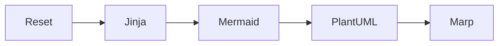

# try-marp-plantuml-mermaid

This project provides a dev container that integrates the tools below to generate diagrams and presentations from text.

* [Jinja](https://jinja.palletsprojects.com/en/stable/) - Templating engine.
* [Mermaid](https://mermaid.js.org/) - Text-base diagraming tool.
* [Marp](https://marp.app/) - Markdown presentation ecosystem
* [PlantUML](https://plantuml.com/) - Text-base diagraming tool.


## 1. Try it

1. Open this project in Codespace (or a local dev container).
2. Open a termainal (`CTRL+SHIFT+~`) and run `build.bash`.
3. Open "Go Live"  (`CTRL+L` then `CRTL+O`) and browse `build/`.

## Quickstart

### 1. Start a new project

The easy way on GitHub...

1. Use this repository as a template to create a new repository on GitHub.
2. Start working in `src/`

The harder way:

1. Create a new repository.
2. Copy this repository's `.devcontainer` into its root.
3. Create a `.gitignore` into its root and add `build/` (or copy this repository's `.gitignore`).
4. Create a `src/` and put your content in it.

### 2. Use

1. Modify content in `src/`.
2. Build all the things (writes to `build/`)
    ```bash
    $ build.bash
    ```
3. View result in Go Live
    1. Click `Go Live` (In VS Code, bottom bar, near the right.)
    2. If a browser doesn't autotmatically open
        1. Open terminal (`CTRL+SHIFT+~`)
        2. Click `PORTS` tab
        3. Click "Web" icon in the row for the link for port 5500.
    3. Navigate into `build/`.
4. Rince and repeat.

### 3. Saving `build/`

You can always rebuild it from src. But when you are ready to deploy what you built, you'll need to save what's in `build/`. Here are your options:

1. Download it.
2. Rename it, then commit it.
3. Move it into a directory that is not ignored by git, then commit it.
4. Rmeove `build/` from .gitignore, then commit it.


## `build.bash`

`build.bash` does the following in order.



1. **Reset:** Empty `build/` and then copy the contents of `src/` into `build/`.
2. **Jinja:** Run jinja on `*.j2` files in `build/`. Each file produces a file whose name is the same as the original file with the `.j2` extension removed. For example, `file.md.j2` produces `file.md`.
3. **Mermaid:** Run mermaid on `*.md` files that contain `mermaid: true`. Each diagram block in `file.md` produces a PNG file: `file.md-1.png`, `file.md-2.png`, etc.
4. **PlantUML:** Run plantuml on `*.md` files that contain `plantuml: true`. Each diagram block in `file.md` produces an SVG file. PlantUML has a vaguely defined number sequence for output file names (<https://plantuml.com/sources#:~:text=File%20naming,t%20match%20the%20output%20format.>). Instead of releying on those, we recommend naming each diagram: e.g., `@startuml name` produces `name.svg`.
5. **Marp:** Run marp on `*.md` files that contain `marp: true`. For each `file.md` produces `file.html`.


## Quick PlantUML

Given the file `hello_world.puml` with contents

```plantuml
@startuml hello
' This generates `hello.svg`
class A {
}
@enduml

@startuml world
' This generates `world.svg`
A -> A
@enduml
```



## Quick Mermaid

Given a file `hello_world.md` with contents

    ```mermaid
    %% Genaertes `hello_world-1.png`
    gitGraph
        commit
    ```

    ```mermaid
    %% Generates `hello_world-2.png`
    flowchart LR
        id
    ```

Notice Mermaid diagrams generate PNGs instead of SVGs. That's because we intend to include them inside of PlantUML diagrams. And right now PlantUML does not parse SVGs generated by Mermaid correctly.

Note: Marp will also generate hello_world.html from this file. But it isn't the presentation you are looking for.
In the future, we may stop Marp from processing `*.md` files that do not have `marp: true` in their header.

## Quick Marp

Given the file hi.md with the contents

```
---
marp: true
---

# Hello from PlantUML


---

# Hello from Mermaid


```

Generates `hi.html`.

Place themes anywhere in src/.

## Quick Jinja

Given the file `_hello.j2` with contents

```jinja

Hello, {{name}}

```

and the file `world.md.j2` with the contents

```jinja

---
marp: true
---

# Say hello

{{ hello("World") }}
```

Generates `world.md` with contents

```markdown
---
marp: true
---

# Say hello

Hello, World
```

`*.j2` files that start with underscore `_` will not processed by Jinja directly, and so do not generate a separate file.


